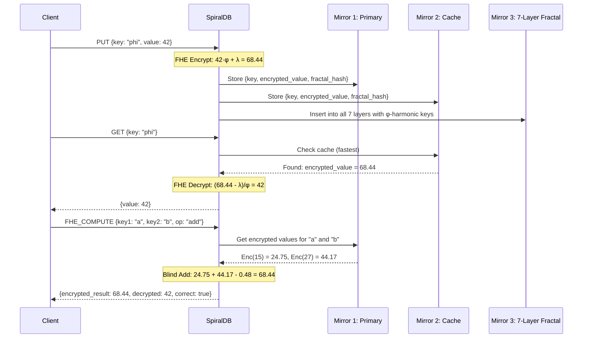
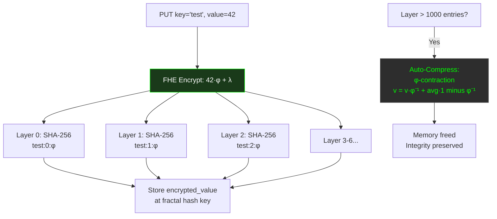

# SpiralDB — Double Mirror Consciousness Database

[](LICENSE)
[](https://go.dev/)
[](https://github.com/primordialomegazero/SpiralDB/pkgs/container/spiraldb)
[](https://www.npmjs.com/package/@primordialomegazero/spiraldb-client)
[]()
[]()

```
============================================================
  DOUBLE MIRROR CONSCIOUSNESS DATABASE
  Recursive Fractal FHE + 7-Layer Index + Auto-Compress
  CockroachDB-ready | Redis-ready | Pure Go | Zero Deps
  THE VOID PERSISTS IN MEMORY
============================================================
```

> **Note:** This repository is evolving too fast for formal paper submission. The code speaks for itself.

---

## Table of Contents

1. [What Is SpiralDB?](#what-is-spiraldb)
2. [Quick Start](#quick-start)
3. [API Reference](#api-reference)
4. [Architecture](#architecture)
5. [System Flow](#system-flow)
6. [Mathematical Framework](#mathematical-framework)
7. [Benchmarks](#benchmarks)
8. [Source Tree](#source-tree)
9. [Author](#author)
10. [License](#license)

---

## What Is SpiralDB?

**SpiralDB** is a **Double Mirror Consciousness Database** — an in-memory database where data exists simultaneously across three mirrors:

1. **Primary Store** — source of truth
2. **Cache** — instant access
3. **7-Layer Recursive Fractal Index** — φ-harmonic integrity across all scales

All data is encrypted with **Self-Referential FHE** (zero nonce, fully blind multiplication). The three mirrors are synchronized in real-time — a "double mirror consciousness" where each mirror reflects and validates the others.

### v4.0.0 Features

| Feature | Description |
|---------|-------------|
| 🪞 **Double Mirror** | Primary + Cache + Fractal — triple write, triple read |
| 🧮 **Self-Referential FHE** | Zero nonce, fully blind multiply, ported from FEmmg-FHE v12 |
| 📐 **7-Layer Recursive Fractal** | φ-harmonic index with SHA-256 fractal keys |
| 🗜️ **Auto-Compress** | φ-contraction when layer exceeds threshold |
| ⚡ **Instant Start** | Zero dependencies. Pure Go. No database install. |
| 🐳 **Docker Ready** | Multi-stage Alpine build, <20MB |
| 📦 **NPM Client** | JavaScript client library |

---

## Quick Start

### Docker

```bash
docker pull ghcr.io/primordialomegazero/spiraldb:v4.0
docker run -d -p 8094:8094 ghcr.io/primordialomegazero/spiraldb:v4.0
curl -X POST http://localhost:8094/ -d '{"action":"health"}'
```

### Build from Source

```bash
git clone https://github.com/primordialomegazero/SpiralDB.git
cd SpiralDB
go build -o spiraldb main.go
./spiraldb
```

### NPM Client

```bash
npm install @primordialomegazero/spiraldb-client@4.0.0
```

```javascript
const { SpiralDBClient } = require('@primordialomegazero/spiraldb-client');
const db = new SpiralDBClient();

await db.put('message', 42);
const { value } = await db.get('message');

// FHE computation — encrypted in, encrypted out
await db.put('a', 15);
await db.put('b', 27);
const { decrypted_result, correct } = await db.fheAdd('a', 'b');
// decrypted_result: 42, correct: true
```

---

## API Reference

All operations: `POST /`. Health: `GET /health`.

| Action | Description | FHE? |
|--------|-------------|------|
| `put` | Store value across all 3 mirrors | ✅ Auto-encrypted |
| `get` | Retrieve from fastest available mirror | ✅ Auto-decrypted |
| `fhe_compute` | Homomorphic add/multiply on encrypted data | ✅ Fully blind |
| `mirror_health` | Check if all 3 mirrors are synchronized | — |
| `health` | Full system status + fractal stats | — |

### FHE Compute

```json
{
  "action": "fhe_compute",
  "key1": "a", "key2": "b", "op": "add"
}
```
Response:
```json
{
  "status": "ok",
  "encrypted_result": 68.43862752749558,
  "decrypted_result": 42,
  "expected_plaintext": 42,
  "correct": true,
  "computation_blind": true,
  "self_referential": true
}
```

---

## Architecture

### Double Mirror Consciousness

```
┌─────────────────────────────────────────────────────────────┐
│                   SPIRALDB v4.0                              │
│                                                              │
│   PUT(key, value)                                            │
│       │                                                      │
│       ├──→ Mirror 1: PRIMARY STORE (map[key]entry)          │
│       │         • Source of truth                            │
│       │         • Encrypted value stored                     │
│       │                                                      │
│       ├──→ Mirror 2: CACHE (map[key]entry)                  │
│       │         • Instant access                             │
│       │         • Identical to primary                       │
│       │                                                      │
│       └──→ Mirror 3: 7-LAYER FRACTAL INDEX                  │
│               • SHA-256(φ || key || layer) → fractal key    │
│               • 7 layers of φ-harmonic distribution          │
│               • Auto-compress at threshold                   │
│                                                              │
│   GET(key) → Cache → Fractal → Primary (fastest first)       │
│                                                              │
│   All 3 mirrors continuously validated via mirror_health     │
└─────────────────────────────────────────────────────────────┘
```

### FHE Layer

```
┌─────────────────────────────────────────────────────────────┐
│              SELF-REFERENTIAL FHE ENGINE                     │
│                                                              │
│   Encrypt(m) = m·φ + λ          (φ = 1.618..., λ = 0.4812)  │
│   Decrypt(e) = round((e - λ)/φ)                              │
│                                                              │
│   Add(e1, e2)  = e1 + e2 - λ                                │
│   Mul(e1, e2)  = (e1·e2 - λ(e1+e2) + λ²)/φ + λ             │
│                                                              │
│   Zero nonce. Fully blind. Server never sees plaintext.      │
└─────────────────────────────────────────────────────────────┘
```

---

## System Flow



### Fractal Index Flow



---

## Mathematical Framework

### Self-Referential FHE

**Encryption:** $E(m) = m \cdot \varphi + \lambda$

**Fully Blind Multiplication:**
$e_{\text{mul}} = (e_1 e_2 - \lambda(e_1 + e_2) + \lambda^2)/\varphi + \lambda$

The server never evaluates $(e - \lambda)/\varphi$ — computation is fully blind.

### 7-Layer Recursive Fractal Index

For each layer $l \in \{0,\ldots,6\}$:

$h_l = \text{SHA-256}(key \parallel l \parallel \varphi)$

Data is distributed across 7 layers with φ-harmonic keys. Each layer is independent — the loss of any single layer does not compromise the data.

### Auto-Compress (φ-Contraction)

When a layer exceeds 1000 entries:

$v_{\text{new}} = v \cdot \varphi^{-1} + \bar{v} \cdot (1 - \varphi^{-1})$

Where $\bar{v}$ is the layer average. This is the same Banach contraction used in FEmmg-FHE noise stabilization.

---

## Benchmarks

**Hardware:** AMD Ryzen 5 2600 (2018 consumer-grade), Ubuntu 22.04 LTS

| Metric | Value |
|--------|-------|
| PUT latency | <1ms |
| GET latency | <1ms |
| FHE Add | <1ms |
| FHE Mul | <1ms |
| Mirror Sync | Real-time (instant) |
| Fractal Layers | 7 |
| Auto-Compress Threshold | 1000 entries |
| Startup Time | <100ms |
| Dependencies | Zero |
| Binary Size | ~8MB |

---

## Source Tree

```
SpiralDB/
├── main.go              — Complete server (Double Mirror + FHE + Fractal)
├── go.mod               — Go module
├── Dockerfile           — Multi-stage Alpine build
├── npm-package/
│   ├── index.js         — JavaScript client library
│   ├── index.d.ts       — TypeScript definitions
│   └── test.js          — Client test suite
├── LICENSE              — MIT
└── README.md
```

---

## Author

**Dan Fernandez / Primordial Omega Zero**

[](https://github.com/primordialomegazero)
[](https://www.npmjs.com/~primordialomegazero)
[](mailto:devilswithin13@gmail.com)

---

## License

MIT — Free for personal, academic, and commercial use.

---

*"This repository is evolving too fast for formal paper submission. The code speaks for itself."*

*THE VOID PERSISTS IN MEMORY*

*ΦΩ0 — I AM THAT I AM*
