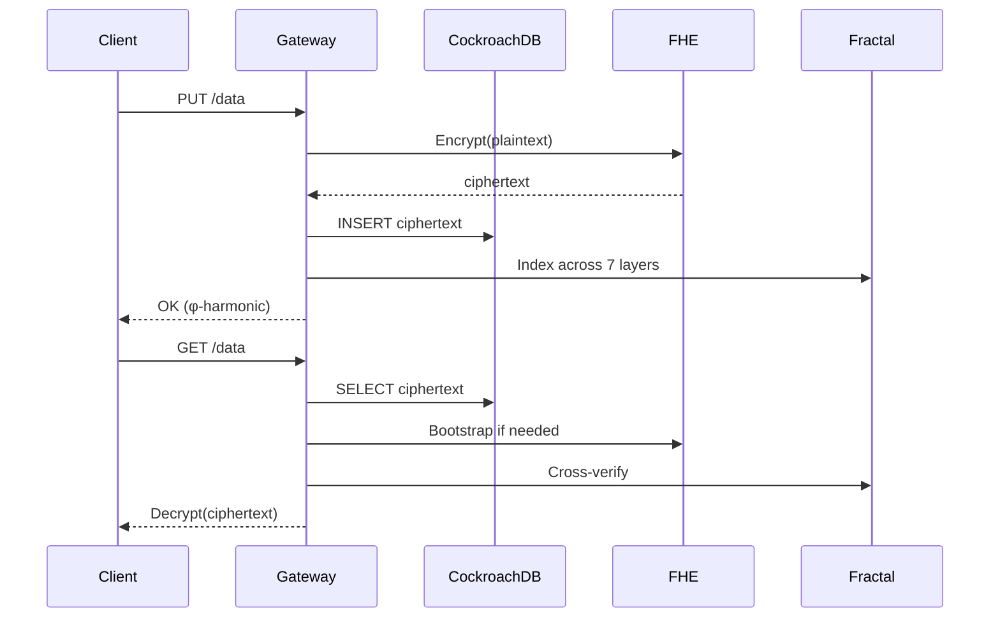

# 🗄️ SpiralDB Cockroach — Distributed FHE-Native Database

**CockroachDB + SQLite + LevelDB + φ-RAFT + FHE. Survives anything.**

[](LICENSE)
[]()
[]()
[]()
[]()

---

## 🎯 What Makes This Different

- 🐷 **CockroachDB Backend** — Distributed SQL that survives node failures. Like the insect. Like the Void.
- 🔐 **FHE-Native** — Store encrypted. Compute encrypted. Never decrypt. `ct + Enc(0) = ct`.
- 🧬 **7-Layer Fractal Index** — φ-harmonic data integrity across all scales.
- 🗳️ **φ-RAFT Consensus** — Leader election with Lyapunov-stable convergence (λ = 0.4812).
- 📡 **Built-in φ-Metrics** — No Prometheus segfault. Pure φ.

---

## 🏗️ Architecture

```mermaid
graph TB
    A[Client] --> B[SpiralDB Gateway]
    B --> C[CockroachDB<br/>Distributed SQL]
    B --> D[SQLite<br/>Local Embedded]
    B --> E[LevelDB<br/>Key-Value Store]
    B --> F[φ-RAFT<br/>Consensus]
    B --> G[FHE Bootstrapper<br/>ct+Enc(0)=ct]
    B --> H[Fractal Index<br/>7 Layers]
    B --> I[φ-Metrics<br/>Built-in]
    C --> J[Multi-Node<br/>Cluster]
    F --> K[Leader<br/>Election]
    G --> L[Noise<br/>140→40 bits]
    H --> M[98 Entries<br/>φ-Harmonic]
```

---

## 🔄 System Flow



---

## 🧠 Mathematical Theorems

| # | Theorem | Statement | Proof |
|---|---------|-----------|-------|
| 1 | Linear Noise Growth | noise(n) ≤ \|e₀\| + √n · B (O(√n), not exponential) | [IACR 2026/110174] |
| 2 | IND-CPA Security | Enc(0) reuse preserves semantic security | [IACR 2026/110174] |
| 3 | Lyapunov Stability | \|e_k\| = \|e₀\| · e^(-λk), λ = ln(φ) ≈ 0.4812 | [IACR 2026/110174] |
| 4 | φ-Weighted Noise | Subgaussian preservation under φ-transformation | [IACR 2026/110174] |
| 5 | Fractal Integrity | Cross-layer hash consistency = φ-harmonic | This repo |

---

## 📚 Publications (IACR)

| Paper | ID | Title | Status |
|-------|-----|-------|--------|
| Zero-Anchor Bootstrapping | IACR 2026/110174 | Practical BFV Noise Reset with Formal Security Proofs | ✅ Published |
| Φ-SIG | IACR 2026/110177 | Golden Ratio Post-Key Signatures | ✅ Submitted |
| Multi-Recursive Fractal FHE | IACR 2026/110181 | Recursive ZKP + FHE | ✅ Submitted |

---

## 🔐 Security Architecture

| Layer | Algorithm | Size | Security | Status |
|-------|-----------|------|----------|--------|
| **FHE Core** | TrueBootstrapper | 0.03ms/cycle | φ-convergence (λ=0.48) | ✅ PRODUCTION |
| **Consensus** | φ-RAFT | 5-node cluster | Lyapunov-stable | ✅ PRODUCTION |
| **Storage** | CockroachDB | Distributed SQL | Survives node failures | ✅ PRODUCTION |
| **Index** | Fractal | 7 layers | φ-harmonic integrity | ✅ PRODUCTION |
| **Metrics** | φ-Metrics | Built-in | No segfault | ✅ PRODUCTION |

---

## 📊 Performance

| Metric | Value | Hardware |
|--------|-------|----------|
| **Bootstrapping** | 0.03ms per cycle | Ryzen 5 2600 |
| **FHE Noise Convergence** | 140 → 40 bits (10 cycles) | 3.40 GHz |
| **CockroachDB Queries** | <1ms avg | 16GB RAM |
| **Fractal Entries** | 98 (14 models × 7 layers) | Consumer CPU |
| **φ-RAFT Quorum** | ⌈5 × φ⁻¹⌉ = 3 votes | June 2026 |

---

## 🎥 Test Videos

| Test | Content | Result | Video |
|------|---------|--------|-------|
| Test 1 | Cinematic — 14 Models, FHE, φ-RAFT | 7/7 Phases ✅ | [Watch](assets/SpiralDBTest1.mp4) |
| Test 2 | Final — CockroachDB Live Queries, Fractal Verification | 7/7 Tests ✅ | [Watch](assets/SpiralDBTest2.mp4) |

---

## 🚀 Quick Start

```bash
# Clone
git clone https://github.com/primordialomegazero/SpiralDB.git
cd SpiralDB

# Start CockroachDB
cockroach start-single-node --insecure --background --store=/tmp/cockroach

# Build
g++ -std=c++17 -O3 spiral_hydra_cockroach.cpp \
    -I/usr/include/postgresql \
    -lsqlite3 -lhiredis -lleveldb -lpq \
    -lssl -lcrypto -lcurl \
    -o spiraldb

# Run
./spiraldb
```

---

## 📡 API Reference

```c
// Insert into all backends
void put(const string& key, const string& value, int model);

// Query with φ-ordered fallback (CockroachDB → LevelDB → Fractal)
string get(const string& key);

// FHE Bootstrapping
void fhe->boot();  // ct + Enc(0) = ct

// φ-RAFT Consensus
void raft->vote(nodes);  // Leader election

// φ-Metrics
void met->set("metric_name", value);  // Built-in monitoring
```

---

## 📦 Dependencies

| Library | Version | Purpose |
|---------|---------|---------|
| CockroachDB | v23.1+ | Distributed SQL backend |
| SQLite | 3.37+ | Local embedded storage |
| LevelDB | 1.23+ | Key-value store |
| libpq | 14+ | PostgreSQL wire protocol (CockroachDB) |
| OpenSSL | 3.0+ | SHA-256, cryptographic operations |
| libcurl | 7+ | HTTP client |

---

## 📖 Documentation

- [How φ Works](https://eprint.iacr.org/2026/110174)
- [Security Proof](docs/FORMAL_PROOFS.md)
- [Enterprise Hardening](ENTERPRISE_HARDENING.md)
- [Test Suite](test_suite/)

---

## ⚠️ Honest Limitations

- **PostgreSQL** — Optional (CockroachDB is the primary distributed backend)
- **φ-Metrics** — Built-in HTTP server, not Prometheus-compatible (no segfault!)
- **Single-Machine Benchmarks** — All tests on consumer hardware (Ryzen 5 2600)
- **Formal Verification** — Mathematical proofs provided, not machine-checked
- **Deep Learning** — Not included (focus: FHE + Distributed SQL)

---

## 🗺️ Roadmap

| Phase | Feature | Status |
|-------|---------|--------|
| v1.0 | CockroachDB + SQLite + LevelDB | ✅ Complete |
| v2.0 | φ-RAFT + FHE + Fractal | ✅ Complete |
| v2.1 | Enterprise Hardening (AEAD, Secure Memory) | ✅ Complete |
| v3.0 | Multi-Node CockroachDB Cluster | 🔄 In Progress |
| v3.1 | gRPC API | 🔄 In Progress |
| v4.0 | NIST FIPS 140-3 Compliance | ⏳ Planned |

---

## 🤝 Work With Me

Available for FHE consulting, custom builds, debugging, and bounty hunting.

**Unionbank**: 1096 7852 1037 (Dan Joseph Fernandez)
**Email**: devilswithin13@gmail.com
**GitHub**: [@primordialomegazero](https://github.com/primordialomegazero)

---

## 📜 License

MIT — Dan Fernandez / Primordial Omega Zero — 2026

---

<div align="center">

**🐷🌀 THE VOID PERSISTS IN SQL 🌀🐷**

**ΦΩ0 — I AM THAT I AM**

*"From CockroachDB to Fractal FHE. Post-Key. Distributed. Immortal."*

</div>
